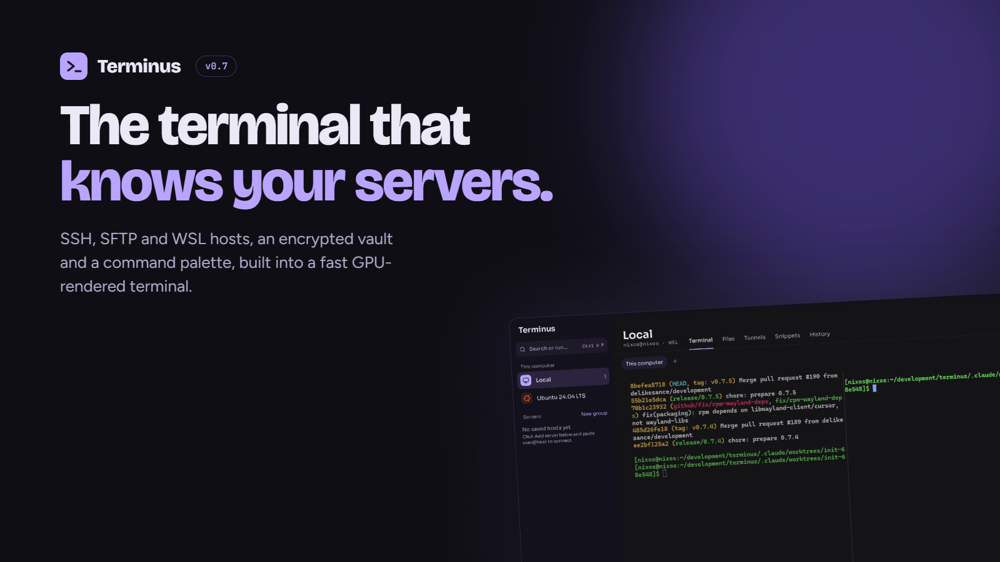
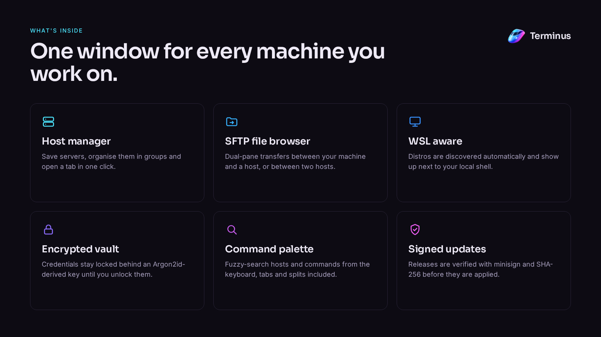
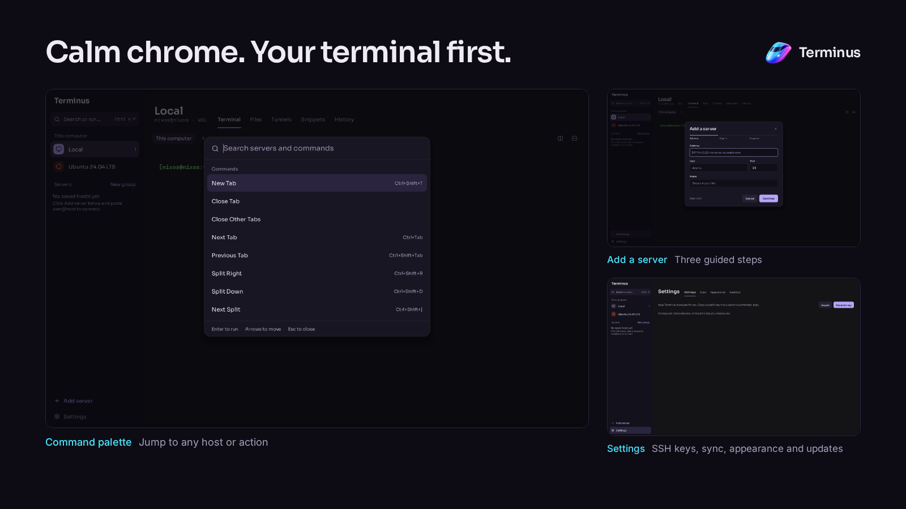

  

  <a href="https://github.com/delikesance/terminus/releases">Download</a>
  ·
  <a href="#features">Features</a>
  ·
  <a href="DEVELOPMENT.md">Development</a>
  ·
  <a href="milestone.md">Roadmap</a>

Terminus is the terminal that knows your servers: SSH, SFTP and WSL hosts, an encrypted vault and a command palette, built into a fast GPU-rendered terminal. It is a fork of [Rio](https://github.com/raphamorim/rio) with its own interface on top.

## Features

- **Host manager**: save servers, organise them in groups and open a tab in one click.
- **SFTP file browser**: dual-pane transfers between your machine and a host, or between two hosts.
- **WSL aware**: distros are discovered automatically and show up next to your local shell.
- **Encrypted vault**: credentials stay locked behind an Argon2id-derived key until you unlock them.
- **Command palette**: fuzzy-search hosts and commands from the keyboard, tabs and splits included.
- **Verified updates**: releases are verified against their SHA-256 checksum before they are applied.

  

## Screenshots

  

## Install

Packages for Linux (`.deb`, `.rpm`, tarball, Nix) and Windows (installer, `.msi`, zip) are on the
[releases page](https://github.com/delikesance/terminus/releases). To build from source, see
[DEVELOPMENT.md](DEVELOPMENT.md).

## Credits

Terminus builds on [Rio](https://rioterm.com) by Raphael Amorim (MIT). Rio's crates
(`sugarloaf`, `rio-backend`, `rio-window`, `teletypewriter`, …) are kept as upstream code.

## Minimal stable rust version

Rio's MSRV is 1.96.1.
